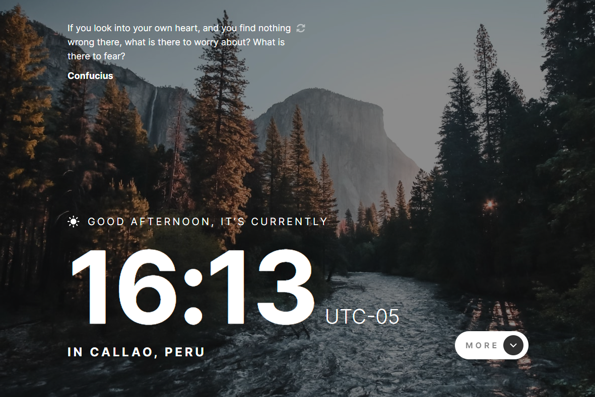

<div align='center'>

  [![demo][demo]][demo-link]
  [![status][status]][status-link]
  [![deploy][deploy]](/)
  [![test][tests]][tests-link]

</div>

<div align='center'>
  <a href='/'>
    
  </a>
</div>

<div align='center'>
  <h1>Clock App with Next.js</h1>
</div>

<div align='center'>

  [![Next.js][nextjs]][nextjs-link]
  [![TypeScript][typescript]][typescript-link]
  [![React][react]][react-link]
  [![date-fns][date-fns]][date-fns-link]
  [![React Hot Toast][react-hot-toast]][react-hot-toast-link]
  [![Vercel][vercel]][vercel-link]

</div>

<div align='center'>
  A real-time clock application built with Next.js 13 and TypeScript that displays the current time, greeting based on time of day, user location via IP geolocation, and random inspirational quotes.

  [Demo]({{DEMO_URL}}) · [Report issue](/issues) · [Suggest something](/issues)
</div>

## Table of Contents

- [Table of Contents](#table-of-contents)
- [Features](#features)
- [Tech Stack](#tech-stack)
- [Getting Started](#getting-started)
  - [Prerequisites](#prerequisites)
  - [Installation](#installation)
  - [Running locally](#running-locally)
  - [Build](#build)
- [Project Structure](#project-structure)
- [Demo](#demo)
- [API Reference](#api-reference)
- [Contributing](#contributing)
- [License](#license)

## Features

- [x] Real-time clock updating every second
- [x] Dynamic greeting based on time of day (morning, afternoon, evening)
- [x] Day and night themes with different background images
- [x] Random inspirational quotes with refresh functionality
- [x] IP-based geolocation displaying city and country
- [x] Expandable information panel with timezone, day of year, day of week, and week number
- [x] Responsive design for desktop, tablet, and mobile
- [x] Toast notifications for loading states and errors
- [x] Next.js 13 App Router with API routes
- [x] Deployed on Vercel

## Tech Stack

- [Next.js 13](https://nextjs.org/)
- [TypeScript](https://www.typescriptlang.org/)
- [React](https://react.dev/)
- [date-fns](https://date-fns.org/)
- [React Hot Toast](https://react-hot-toast.com/)
- [Normalize.css](https://necolas.github.io/normalize.css/)
- [Vercel](https://vercel.com/)

## Getting Started

### Prerequisites

- Node.js 18+
- npm, yarn, pnpm, or bun

### Installation

```bash
git clone https://github.com/wrujel/clock-app.git
cd clock-app
npm install
```

### Running locally

```bash
npm run dev
```

Open [http://localhost:3000](http://localhost:3000) with your browser to see the result.

### Build

```bash
npm run build
```

## Project Structure

```
/
├── app/
│   ├── api/
│   │   ├── route.ts
│   │   ├── data/
│   │   │   └── route.ts
│   │   └── quote/
│   │       ├── route.ts
│   │       └── quotes-data.ts
│   ├── components/
│   │   ├── IconArrowDown.tsx
│   │   ├── IconArrowUp.tsx
│   │   ├── IconMoon.tsx
│   │   ├── IconRefresh.tsx
│   │   ├── IconSun.tsx
│   │   └── Loader.tsx
│   ├── globals.css
│   ├── layout.tsx
│   ├── page.module.css
│   └── page.tsx
├── public/
│   ├── assets/
│   │   ├── desktop/
│   │   ├── mobile/
│   │   └── tablet/
│   └── screenshot.png
├── next.config.js
├── package.json
└── tsconfig.json
```

## Demo

You can check out the demo:

[![Demo][demo]][demo-link]

## API Reference

| Method | Endpoint     | Description                          | Auth Required |
| :----- | :----------- | :----------------------------------- | :-----------: |
| `GET`  | `/api`       | Returns API info                     |      No       |
| `POST` | `/api/data`  | Get geolocation data and quote by IP |      No       |
| `GET`  | `/api/quote` | Get a random inspirational quote     |      No       |

## Contributing

Contributions are welcome! If you have suggestions or find bugs, please open an issue or submit a pull request.

1. Fork the repository
2. Create your feature branch (`git checkout -b feature/amazing-feature`)
3. Commit your changes (`git commit -m 'Add some amazing feature'`)
4. Push to the branch (`git push origin feature/amazing-feature`)
5. Open a Pull Request

## License

This project is not currently licensed.

---

<!-- Badges -->
[nextjs]: https://img.shields.io/badge/Next.js-black?style=for-the-badge&logo=next.js
[typescript]: https://img.shields.io/badge/Typescript-007ACC?style=for-the-badge&logo=typescript&logoColor=white&color=blue
[react]: https://img.shields.io/badge/React-20232A?style=for-the-badge&logo=react&logoColor=61DAFB
[date-fns]: https://img.shields.io/badge/Date--fns-F7841B?style=for-the-badge&logo=date-fns&logoColor=white
[react-hot-toast]: https://img.shields.io/badge/React--Hot--Toast-2A2A2A?style=for-the-badge&logo=npm&logoColor=white
[vercel]: https://img.shields.io/badge/Vercel-000000?style=for-the-badge&logo=vercel&logoColor=white

<!-- Badge links -->
[nextjs-link]: https://nextjs.org/
[typescript-link]: https://www.typescriptlang.org/
[react-link]: https://react.dev/
[date-fns-link]: https://date-fns.org/
[react-hot-toast-link]: https://react-hot-toast.com/
[vercel-link]: https://vercel.com/

<!-- Status badges -->
[demo]: https://img.shields.io/badge/🚀%20Live%20Demo-Click%20Here-blue?style=for-the-badge
[demo-link]: https://clock-app-wrujel.vercel.app/
[status]: https://img.shields.io/endpoint?url=https%3A%2F%2Fraw.githubusercontent.com%2Fwrujel%2Fmonitor-repos%2Fmain%2Fdata%2Fclock-app.json
[status-link]: https://github.com/wrujel/monitor-repos
[deploy]: https://img.shields.io/github/deployments/wrujel/clock-app/production?style=for-the-badge&label=Deploy
[tests]: https://img.shields.io/endpoint?url=https%3A%2F%2Fraw.githubusercontent.com%2Fwrujel%2Fmonitor-tests%2Fmain%2Fdata%2Fclock-app.json
[tests-link]: https://github.com/wrujel/monitor-tests
