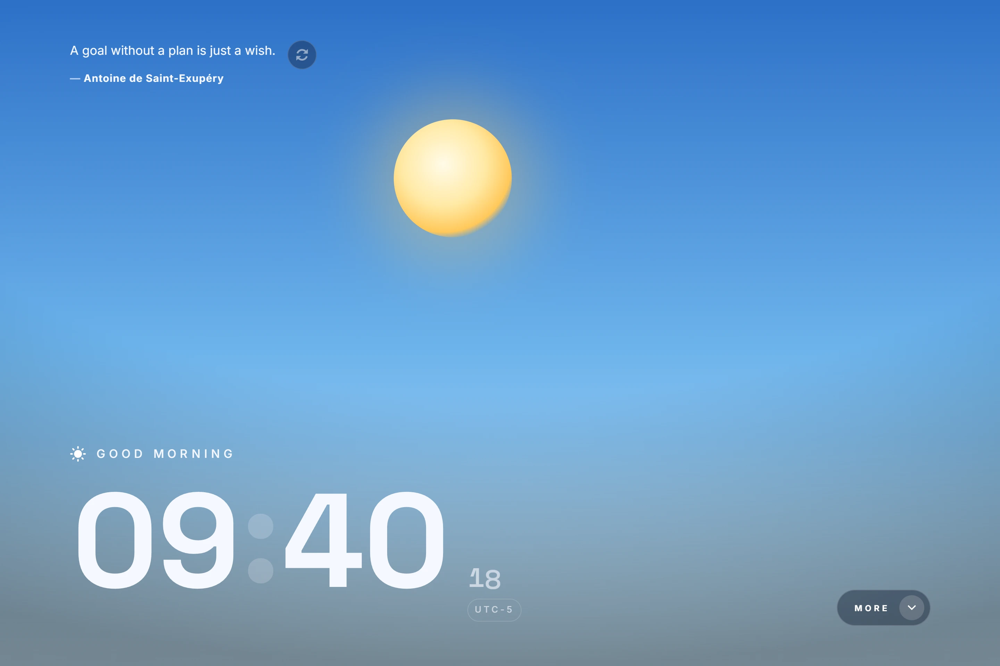

<div align='center'>

[![demo][demo]][demo-link]
[![status][status]][status-link]
[![deploy][deploy]](/)
[![test][tests]][tests-link]

</div>

<div align='center'>
  <a href='/'>
    
  </a>
</div>

<div align='center'>
  <h1>Circadia - Clock app</h1>
</div>

<div align='center'>

[![Next.js][nextjs]][nextjs-link]
[![TypeScript][typescript]][typescript-link]
[![React][react]][react-link]
[![Framer Motion][framer-motion]][framer-motion-link]
[![React Hot Toast][react-hot-toast]][react-hot-toast-link]
[![Vercel][vercel]][vercel-link]

</div>

<div align='center'>
  Circadia — a living clock built with Next.js 13 and TypeScript. A procedural sky repaints itself across the 24-hour cycle, split-flap digits tick out the local time, and an expandable panel adds timezone, day-of-year and week details alongside IP-based location and a rotating quote.

[Demo][demo-link] · [Report issue](/issues) · [Suggest something](/issues)

</div>

## Table of Contents

- [Table of Contents](#table-of-contents)
- [Features](#features)
- [Tech Stack](#tech-stack)
- [Getting Started](#getting-started)
  - [Prerequisites](#prerequisites)
  - [Installation](#installation)
  - [Running locally](#running-locally)
  - [Build](#build)
- [Environment Variables](#environment-variables)
- [Project Structure](#project-structure)
- [Demo](#demo)
- [API Reference](#api-reference)
- [Contributing](#contributing)
- [License](#license)

## Features

- [x] Procedural sky background that interpolates a 24-hour colour gradient — night, dawn, day, dusk — with stars fading in after dark
- [x] Split-flap clock digits that spring-flip on every change
- [x] Ticking clock that pauses while the tab is hidden and resyncs on return
- [x] Time-of-day greeting with a per-letter masked reveal and sun/moon swap
- [x] IP-based geolocation displaying city and country
- [x] Random inspirational quotes with refresh
- [x] Expandable stats panel — timezone, day of year, day of week and week number, with counters that animate up
- [x] Cursor-follow glow and magnetic hover on the toggle button
- [x] `prefers-reduced-motion` respected across the flip clock and stats panel
- [x] Boot loader, film-grain overlay and self-hosted Google Fonts via `next/font`
- [x] Toast notifications for loading states and errors
- [x] Next.js 13 App Router with API routes
- [x] Responsive design for desktop, tablet, and mobile
- [x] Deployed on Vercel

## Tech Stack

- [Next.js 13](https://nextjs.org/)
- [React 18](https://react.dev/)
- [TypeScript](https://www.typescriptlang.org/)
- [Framer Motion](https://motion.dev/)
- [React Hot Toast](https://react-hot-toast.com/)
- [CSS Modules](https://github.com/css-modules/css-modules)
- [Vercel](https://vercel.com/)

## Getting Started

### Prerequisites

- Node.js 18+
- npm, yarn, pnpm, or bun

### Installation

```bash
git clone https://github.com/wrujel/clock-app.git
cd clock-app
npm install
```

### Running locally

```bash
npm run dev
```

Open [http://localhost:3000](http://localhost:3000) with your browser to see the result.

### Build

```bash
npm run build
```

| Command         | Action                                      |
| :-------------- | :------------------------------------------ |
| `npm install`   | Installs dependencies                       |
| `npm run dev`   | Starts local dev server at `localhost:3000` |
| `npm run build` | Builds the production app                   |
| `npm start`     | Serves the production build                 |
| `npm run lint`  | Lints the project with ESLint               |

## Environment Variables

This project does not require any environment variables for basic usage.

## Project Structure

```
/
├── app/
│   ├── api/
│   │   ├── data/
│   │   │   └── route.ts
│   │   ├── quote/
│   │   │   ├── quotes-data.ts
│   │   │   └── route.ts
│   │   └── route.ts
│   ├── components/
│   │   ├── CursorGlow.tsx
│   │   ├── FlipClock.tsx
│   │   ├── IconArrowDown.tsx
│   │   ├── IconMoon.tsx
│   │   ├── IconRefresh.tsx
│   │   ├── IconSun.tsx
│   │   ├── Loader.tsx
│   │   ├── MagneticButton.tsx
│   │   ├── Quote.tsx
│   │   ├── SkyBackground.tsx
│   │   └── StatsPanel.tsx
│   ├── hooks/
│   │   └── useNow.ts
│   ├── globals.css
│   ├── layout.tsx
│   ├── page.module.css
│   └── page.tsx
├── public/
│   ├── assets/
│   └── favicon-32x32.ico
├── next.config.js
├── package.json
└── tsconfig.json
```

## Demo

You can check out the demo:

[![Demo][demo]][demo-link]

## API Reference

| Method | Endpoint     | Description                          | Auth Required |
| :----- | :----------- | :----------------------------------- | :-----------: |
| `GET`  | `/api`       | Returns API info                     |      No       |
| `POST` | `/api/data`  | Get geolocation data and quote by IP |      No       |
| `GET`  | `/api/quote` | Get a random inspirational quote     |      No       |

## Contributing

Contributions are welcome! If you have suggestions or find bugs, please open an issue or submit a pull request.

1. Fork the repository
2. Create your feature branch (`git checkout -b feature/amazing-feature`)
3. Commit your changes (`git commit -m 'Add some amazing feature'`)
4. Push to the branch (`git push origin feature/amazing-feature`)
5. Open a Pull Request

## License

This project is not currently licensed.

---

<!-- Badges -->

[nextjs]: https://img.shields.io/badge/Next.js-black?style=for-the-badge&logo=next.js
[typescript]: https://img.shields.io/badge/Typescript-007ACC?style=for-the-badge&logo=typescript&logoColor=white&color=blue
[react]: https://img.shields.io/badge/React-20232A?style=for-the-badge&logo=react&logoColor=61DAFB
[framer-motion]: https://img.shields.io/badge/Framer%20Motion-2A2A2A?style=for-the-badge&logo=npm&logoColor=white
[react-hot-toast]: https://img.shields.io/badge/React--Hot--Toast-2A2A2A?style=for-the-badge&logo=npm&logoColor=white
[vercel]: https://img.shields.io/badge/Vercel-000000?style=for-the-badge&logo=vercel&logoColor=white

<!-- Badge links -->

[nextjs-link]: https://nextjs.org/
[typescript-link]: https://www.typescriptlang.org/
[react-link]: https://react.dev/
[framer-motion-link]: https://motion.dev/
[react-hot-toast-link]: https://react-hot-toast.com/
[vercel-link]: https://vercel.com/

<!-- Status/Demo badges -->

[demo]: https://img.shields.io/badge/🚀%20Live%20Demo-000000?style=for-the-badge&&logoColor=white&color=0a6bdb
[status-link]: https://github.com/wrujel/monitor-repos
[tests-link]: https://github.com/wrujel/monitor-tests
[demo-link]: https://clock-app-wrujel.vercel.app/
[status]: https://img.shields.io/endpoint?url=https%3A%2F%2Fraw.githubusercontent.com%2Fwrujel%2Fmonitor-repos%2Fmain%2Fdata%2Fclock-app.json
[deploy]: https://img.shields.io/github/deployments/wrujel/clock-app/production?style=for-the-badge&label=Deploy
[tests]: https://img.shields.io/endpoint?url=https%3A%2F%2Fraw.githubusercontent.com%2Fwrujel%2Fmonitor-tests%2Fmain%2Fdata%2Fclock-app.json
